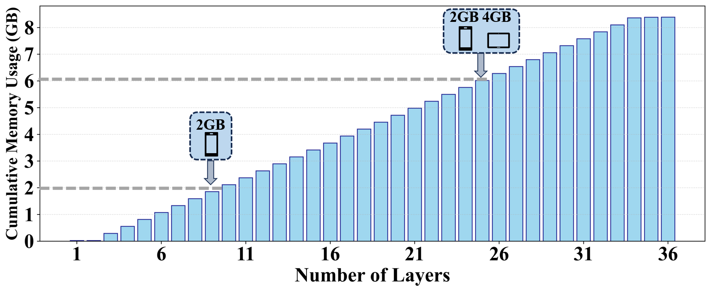
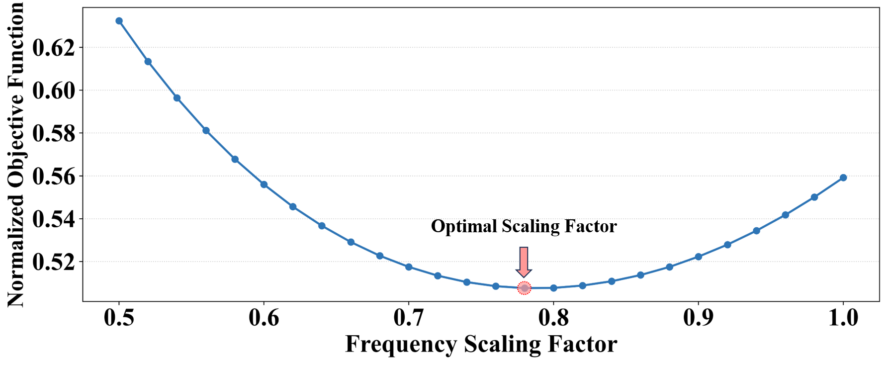
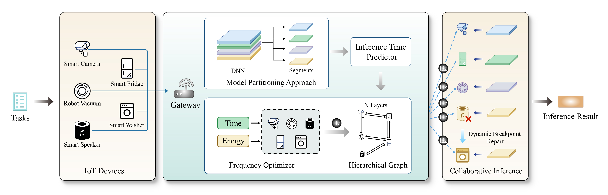

# IWQoS2026-COINFER:Breaking the Resource Wall for Collaborative Edge Inference

## Abstract

Deploying large DNNs on edge devices is severely hindered by strict hardware constraints. Multi-device collaborative inference mitigates this bottleneck. However, existing frameworks struggle in heterogeneous edge environments. They rely on inaccurate theoretical metrics and ignore memory bottlenecks, causing out-of-memory failures. Furthermore, they isolate model partitioning from hardware configurations like dynamic frequency scaling. This isolation yields suboptimal latency and energy trade-offs. 
To address these challenges, we propose **COINFER**, a collaborative edge inference framework, which jointly optimizes model partitioning, device allocation, and frequency scaling. To model hardware heterogeneity, COINFER introduces a lightweight predictor. This predictor fuses neural network attributes with microarchitectural features to accurately estimate inference latency. Guided by these profiles, a two-level scheduler orchestrates task execution. The upper tier explores the global frequency space. Concurrently, the lower tier executes a memory-constrained hierarchical graph search to identify optimal routing paths. For fault tolerance, **COINFER** integrates an adaptive backtracking mechanism to rapidly recover from unexpected node failures. Experiments on a 20-node cluster show **COINFER** reduces scheduling overhead by $42$%, and saves up to $46.4$% of inference time when device fails unexpectedly.

## Background and motivation

### Profiling the OOM Vulnerability in Edge Inference

While prevalent collaborative inference schemes effectively minimize  latency via computation-centric load balancing, they frequently abstract away the heterogeneous memory capacities of edge devices. This oversight implicitly models memory as an infinite resource rather than a hard constraint.

As evidenced by our profiling of the ViT\_H\_14 model is shown below, cumulative peak memory consumption exhibits monotonic and rapid growth as inference propagates through successive layers. Consequently, a resource-constrained node, such as a mobile device with only 2.0 GB RAM, reaches saturation within the first 9 layers. Conventional computation-centric partitioning strategies, being agnostic to these memory dynamics, may inadvertently schedule subsequent layers to such saturated nodes, inevitably precipitating OOM failures. 

Furthermore, we observe that naively provisioning additional resources does not guarantee system stability. As illustrated, even with the other introduction of a 4.0 GB node (tablet), the system remains vulnerable, i.e., the escalating cumulative memory demand breaches the aggregate 6.0 GB capacity by Layer 25. **Therefore, adhering to memory constraints is a foundational prerequisite for edge inference, far beyond a performance concern.**\

### Analyzing the Impact of Frequency Scaling on System QoS

While memory capacity imposes a hard constraint on inference feasibility, the operating frequency of edge devices serves as a pivotal lever for determining the optimality of System-level Quality of Service (QoS). Conventional collaborative frameworks typically adopt a ``race-to-idle'' strategy, defaulting devices to their maximum frequency to minimize execution latency. However, this aggressive approach often proves sub-optimal when energy efficiency is a coordinate objective, primarily due to the super-linear relationship between operating frequency and dynamic power consumption.

As quantified is shown below, our evaluation of a joint objective function—balancing inference latency against energy consumption—reveals a distinct convex optimization profile. In the low-frequency regime (e.g., scaling factor $\approx 0.5$), the objective cost is dominated by prolonged inference latency. Conversely, as the factor approaches saturation ($1.0$), the cost surges again, driven by excessive energy penalties that outweigh marginal gains in speed. This convexity implies the existence of an optimal intermediate ``sweet spot'' that maximizes the latency-energy trade-off. 

In a heterogeneous collaborative environment, this optimization landscape becomes significantly more intricate. Local frequency decisions are not isolated; they propagate through the inference pipeline, altering the idle times and synchronization overhead of downstream nodes. Consequently, **system-level frequency tuning emerges as a critical control knob**. By dynamically orchestrating the operating frequencies of participating nodes, the system can steer clear of inefficient extremes and converge on a globally optimal QoS configuration.

## System Design

The **COINFER** architecture presents a frequency-aware distributed inference scheme orchestrated by an edge gateway to jointly optimize model partitioning, device allocation, and frequency scaling across heterogeneous IoT devices, the whole architecture of system is shown as blow. Upon receiving an inference task, the gateway applies a model partitioning approach to decompose the target deep neural network into discrete computational segments. To establish a foundation for precise scheduling, the offline phase of **COINFER** utilizes machine learning-based latency predictors for accurate latency estimation on physical devices.

During runtime, a frequency optimizer integrates these predictions with device energy models to construct a hierarchical graph representing the available resource allocation space. Operating on this topology, **COINFER** adopts a two-level optimization strategy: the outer layer employs a TPE optimizer to dynamically adjust device frequencies, while the inner layer utilizes a hierarchical directed graph multi-objective shortest-path search to determine device mapping under memory constraints.
The gateway subsequently dispatches the mapped segments to selected edge nodes to execute collaborative inference. To ensure reliable execution against hardware volatility, a breakpoint repair mechanism seamlessly migrates interrupted workloads to alternative devices upon node failures. Simulation results demonstrate that **COINFER** reduces scheduling delays and achieves superior inference performance compared to existing strategies.

